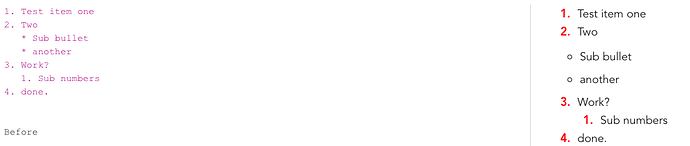

# Joplin Forums - Share Your CSS

This is a collection of `userstyle.css` and `userchrome.css` from the
[Share your CSS](https://discourse.joplinapp.org/t/share-your-css/1730) thread
on the Joplin forums.

## Contents

There's a `*-userstyle.css` containing the styles and a `*-userstyle.png`
screen shot showing the results.

Styles included from these forum users:

* betternote
* davidpoza
* etcSudoers
* krc
* lynn (I added some font fallbacks.)
* merlinuwe
* myt00seven
* tatoosh
* zblesk

More styles from the thread:

* [AtBios'](https://github.com/TobiasDev/Joplin-Custom-CSS)
* [charlesdaniels'](https://git.sr.ht/~charles/dotfiles/tree/master/overlay/.config/joplin-desktop/userstyle.css)
  which needs the [Computer Modern Unicode](https://cm-unicode.sourceforge.io/)
  font.
* [lightzhan's](https://github.com/lightzhan/joplin-theme-gloden-2020), which
  includes additional font files.
* [mattsbennett's](https://github.com/mattsbennett/joplin-Nord2)
* [tessus'](https://github.com/tessus/joplin-custom-css)
* [uxamanda's](https://github.com/amandamcg/joplin-theme) amazing work
* [xplosionmind's](https://github.com/xplosionmind/joplin-theme)

### The Light Styles

betternote:

davidpoza:

etcSudoers:

krc:

lynn:

tatoosh:

### The Dark Styles

merlinuwe:

myt00seven:

zblesk:

## License

I have no idea. These were publicly posted on the forums in a thread called
_Share_ Your CSS, so I assume folks are OK with people using them.

If you're _not_ happy that your work is here, just
[let me know](mailto:chrish@taffer.ca) and I'll happily remove it.
